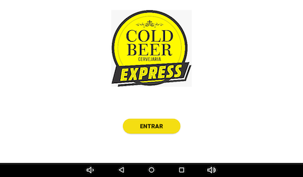
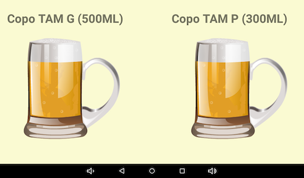
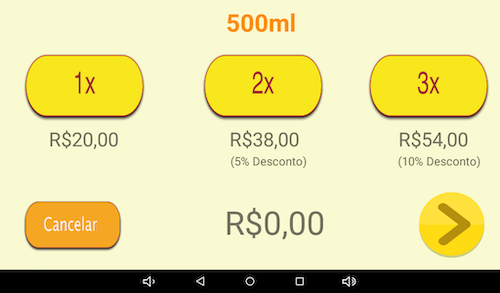
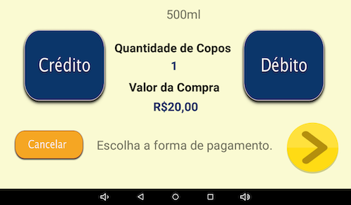
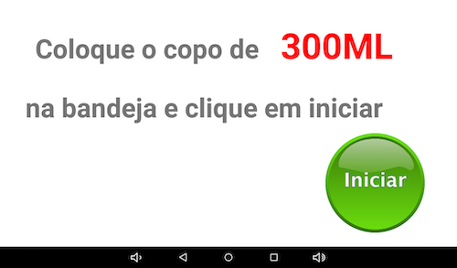
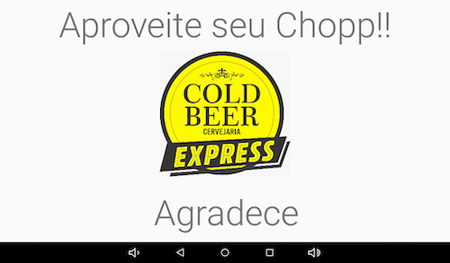

# ColdBeer
Projeto em android desenvolvido para um cliente Bar Cold Beer, onde o cliente tem uma equipamento 
para vender sua cerveja artesanal.

# Projeto 
O app foi desenvolvido para ficar num tablet conectado ao um arduino.
A idéia do app é que o cliente entre, escolha o tamanho da caneca depois escolha a quantidade de cerveja e
finalizando escolha a forma de pagamento(cartão de crédtio ou débito). Assim que confirmado o pagamento o app enviaria 
um comando para o arduino liberar a quantidade exata de cerveja.

# ScreenShots

  
  
  
  
  
  

## Bibliotecas
- [PagSeguro](https://devs.pagseguro.uol.com.br/docs/plugpag-moderninha-wifi-android): Biblioteca escolhida para pagamento.
- [MaterialStyledDialogs](https://github.com/javiersantos/MaterialStyledDialogs): Uma biblioteca que mostra uma  personalizável caixa de diálogo baseada em material com cabeçalho.
- [JavaMail API](https://javaee.github.io/javamail/Android): é uma biblioteca que permite de forma fácil realizar envios de e-mails.

# Autor
- Otávio Augusto - otavio.le@gmail.com  
 
